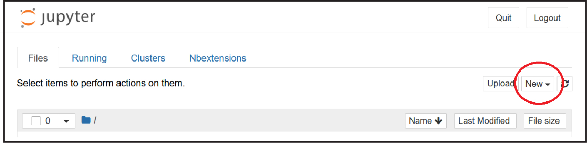
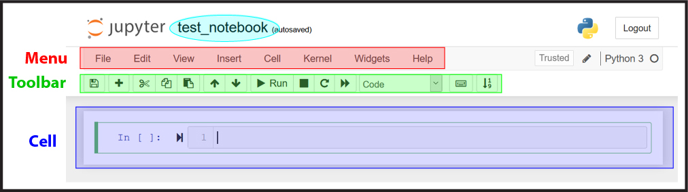
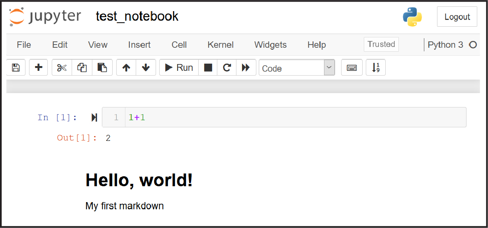

# Practical Python Week 0: Getting Started


Welcome to **Practical Python**. Python is an amazing language: it is powerful, useful, ubiquitous, and relatively easy to learn -- even for beginners. This week we will focus mainly on setting up your programming environment, and a little preview of the Python you will learn in Week 1.

Getting a programming environment set up that will work without any hiccups is essential. With Python, this step can sometimes be daunting because there are so many options -- unlike  Matlab, which has a single convenient interface, Python has at least a dozen to choose from. Hence, to avoid confusion and be sure we are all on the same page, our first lesson is going to be on how to set up and test drive one popular programming environment for scientific computing.

We are going to be using anaconda (technically, a streamlined version of anaconda called *miniconda*), and Jupyter. Jupyter notebooks have become the *de facto* standard that scientists that program in Python use for communicating with one another.

Please be sure to set aside a good chunk of time for this initial step, as it isn't just about installation, but about practicing how to start and use Jupyter notebooks, learning about Python, among other things. Also, there is a slight chance you will end up in install hell, and it will be crucial to escape before our first real class.

# 1. Install and test Python
## Install miniconda (Python)
We will be installing Python version 3.8 (64 bit), following the directions below. Installation will probably go smoothly and quickly, but if you run into snags, Google is your friend. There are lots of great online resources like [Stack Overflow](https://stackoverflow.com/) where people post their solutions to problems.

*Windows users*
1. Go to the download page:https://docs.conda.io/en/latest/miniconda.html and download the installer for Python 3.8 (`Miniconda3-latest-Windows-x86_64.exe`).
2. Once downloaded, click on the executable and accept all the default settings

*Mac users*
1. Go to the download page:https://docs.conda.io/en/latest/miniconda.html and download the package installer for Python 3.8 (`Miniconda3-latest-MacOSX-x86_64.pkg`).
2. Once downloaded, click on the package file and accept all the default settings during settings (e.g., install for me only, allow to access downloads folder).
3. Open the Terminal application and go to your home directory (go home using the `cd ~` command). If conda is activated, you will see the word `(base)` before your terminal prompt. In that case, go to step 5. If not, then go to step 4.
4.  Enter the following commands in your terminal:
```
    cd ~    
    bash        
    source .bash_profile    
    conda init zsh    
```
5. Close the terminal and open a new one. You should see the word `(base)` in front of your terminal prompt, which means anaconda was installed. Type in the following just to test it:
```
conda list
```
If you see a list of stuff, then it worked, congrats!


## Test Python
1. First, open your terminal:
- In Windows, click your Windows button and search `Anaconda` and you will see `Anaconda Prompt` click on it, and you will open a special Anaconda terminal. Right click to pin it to your taskbar because you will be using this all the time.
- On the Mac, just open your Terminal app as before.
2. In the terminal, type in the word `python`. Your prompt should change to the python prompt `>>>`!
3. In your new Python terminal, enter    
    `print(“hello world!”)`
4. Write `exit()` into your terminal (be sure to include parentheses), and it will bring you back to your original terminal. Close your terminal.

Congratulations! if everything worked, you are ready to become a Pythonista! You could actually start writing Python code in your terminal. However, thaw would quickly become very tedious, so let's install Jupyter next, so you can have a more pleasant programming experience.

# 2. Install and test Jupyter
When you installed anaconda, you weren’t just installing Python. Conda is a powerful tool for managing and installing Python packages -- it is used by everyone who does data analysis in Python. We will use it for all sorts of things in the class, starting with Jupyter.

## Install Jupyter
Let's go back to your Anaconda prompt (Windows) or your terminal (Mac). Enter the following command:

    conda install jupyter git

You will be prompted about whether you are sure you want to proceed: type in yes (`y`).

## Hello, Jupyter: create a notebook
1. Create a folder for all your class stuff:, go into that folder, and start your Jupyter notebook server
- On the mac, in the terminal:
```
    cd ~
    mkdir learning_python
    cd learning_python
    jupyter notebook
```
- In Windows in the Anaconda prompt:
```
    mkdir learning_python
    cd learning_python
    jupyter notebook
```
You will be doing those last two commands very frequently during this class. That is:
```
cd learning_python
jupyter notebook
```
is how you will launch your programming environment and start your Jupyter server, so you probably will want to get used to doing this.

2. The above commands should start your Jupyter server, and open up your Jupyter home page in your browser. It will look like this:

    

We will look at all this in more detail later.

3.  Click on the `New` dropdown menu (circled in red in the image above) and click on `Python 3` to open up your first Jupyter notebook. It will look like this:


The notebook name (circled in cyan) will be  `Untitled` at first: you can click on the title field and name it something else like `test_notebook`.

4. Double-click into the empty cell and type in `1+1` and then `shift-Enter` to run the code. You should then see the number `2` printed out, and you should be taken to a new cell.

5. Once emphasis is on the the new cell, in the Toolbar dropdown where it says `Code` click and select `Markdown`. Now go back into the blank cell and enter the following lines:

```
     # Hello World!
     My first markdown
```
And when done, click `shift-Enter` on your keyboard to enter the information. Your notebook should now look something like this:



6. Save your work (click on the save icon in the toolbar, or `ctrl-s`).

If all of the above worked, congratulations, you have successfully set up your Python programming environment! You can safely close your Jupyter tabs and hit `ctrl-c` in your terminal to close the Jupyter server.

Now that we know everything is set up properly, we can actually start the class properly.

# 3. Download and run a test notebook
We are now going to download the content of the class from github. In your terminal, let's go to the folder you made for the class:

    cd learning_python
    git clone https://github.com/EricThomson/practical_python
    cd practical_python
    jupyter notebook

What we have done is gone into the course folder, downloaded the course content from git into directory therein called `practical_python`, entered that directory and launched the Jupyter server from there.  

In the server home page you will see lots of notebooks you downloaded for the class: click on  `week0.ipynb`. This notebook contains the main lesson for your first week: it includes some basic background about programming, Python, Jupyter notebooks, gives you a chance to practice entering stuff in Jupyter. Finally it gives a little preview of the Python we will be covering in Week 1.

Give yourself some time to read/work on the week 0 notebook.

# 4. Celebrate!
If you have made it through the steps above, then pat yourself on the back and take a break.  You are well on your way to using Python for cool data analysis, visualization, and machine learning applications. Most importantly, you are ready for our first actual class. You have parked your car facing downhill, ready to release the parking break and move fast and break things!
