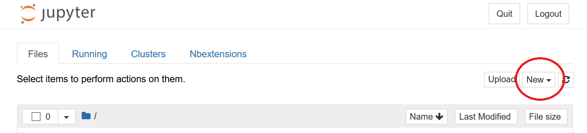
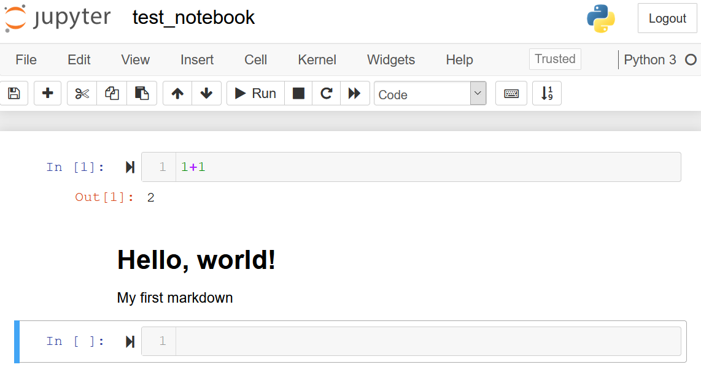

# Practial Python Week 0: Getting Started


Python is an amazing language: it is powerful, useful, ubiquitous, and relatively easy to learn -- even for beginners.

One of the most important steps is getting your programming environment set up. This can sometimes be daunting because there are so many options. Unlike  Matlab, which has a single convenient interface, Python has at least a dozen to choose from. To avoid confusion, and be sure we are all on the same page, our first lesson (before we even meet) will be to set up and test drive one such programming environment.

We are going to be using anaconda (technically, a streamlined version of anaconda called *miniconda*), and Jupyter. Jupyter notebooks have become the *de facto* standard that Python programmers use these days for communicating with one another.

By following the steps below, you will get miniconda and Jupyter installed on your computer, and give them both a test run to make sure everything is working properly. You will also download and run your first notebook, which will include an introduction to Jupyter and Python. All this preparation will let us spend our first class entirely on coding rather than “My Python is broken”.

Note for this pre-class you are going to be doing a lot of steps like "First install this and test it. Now install that other thing and test *it*." Some of it will be a bit repetitious, and this is intentional. We are going to be repeating a lot of things in this class. Programming is largely muscle memory, so repetition is key.

Please be sure to set aside a good chunk of time for this initial bit. If the following steps go *very smoothly*, I would expect it to take a conscientious beginner about [[FOUR]] hours. However, if you end up in install hell, it could take longer, so please plan accordingly.

#### A sidebar on install hell


Install hell is something that everyone goes through: it is **not** an indication that "Programming isn't for me". I love programming, and I have literally spent *weeks of my life* in install hell. Google is your friend: millions of people have installed the following software packages; if you run into a problem, someone else has also run into it and ranted about it online with a solution. I am also here to help (especially if you are in Windows).

# 1. Install and test Python
## Install miniconda (Python)
First, download the version of miniconda appropriate for your OS:
https://docs.conda.io/en/latest/miniconda.html

Install Python version 3.8 (64 bit), following the directions below. Installation will probably go smoothly and quickly, but if you run into snags, Google is your friend. There are lots of great resources, both videos and web sites, from folks who have been through install hell who want to help. If you remain stuck, contact me on Slack.

*Windows users*

1. Download and click on the executable (Miniconda3-latest-Windows-x86_64.exe).
2. During installation, under Advanced Options it will ask if you want to add Anaconda to your Path environment variable.  Click yes (it will tell you it is not recommended, but do it as it will make your life much easier). Also leave the other option clicked (‘Register Miniconda as my default Python’).

*Mac users*

1. Download the file to your Downloads folder (Miniconda3-latest-MacOSX-x86_64.sh)
2. Open a terminal and go to your Downloads folder (cd Downloads), and install miniconda with `bash Miniconda3-latest-MacOSX-x86_64.sh`. You will probably need to press the space bar a bunch of times to scroll through some stuff, and then ‘y’ or ‘yes’ to accept the miniconda license. Close your terminal.

You should now have conda (and therefore Python) installed on your system! Let’s test this out. The way it works is that there will be an Anaconda prompt you can open, and from there the magic happens. Let’s test it out.

## Test Python
1. First, open your conda terminal:
- In Windows, click your Windows button and search `Anaconda` and you will see `Anaconda Prompt` click on it, and you will open a special Anaconda terminal. Right click to pin it to your taskbar because you will be using this all the time.
- On the Mac, just open a terminal it is already a conda terminal because Macs are pretty much built for developers.

2. Once the conda terminal is open, type in the word `python`. This should change things – you should have opened up Python and see a new Python terminal (your prompt will now be `>>>`)!
3. In your new Python terminal, enter    
    `print(“hello world!”)`

4. Congrats! You have written some Python code! Now write `exit()` into your terminal (be sure to include parentheses), and it will bring you back to your system terminal. Close your terminal.

There you have it, if everything worked you are ready to become a Pythonista! But you don’t want to code at the terminal it would quickly become very tedious. Let’s install Jupyter next, so you can have a more pleasant programming experience.

# 2. Install and test Jupyter
When you installed anaconda, you weren’t just installing Python. Conda is a powerful tool for managing and installing Python packages -- it is used by everyone who does data analysis in Python. We will use it for all sorts of things in the class, starting with Jupyter.

## Install Jupyter
Let's go back to your Anaconda prompt (Windows) or your terminal (Mac). We will now install Jupyter so we can use Jupyter notebooks. Enter the following command:

    conda install jupyter git

You will be prompted about whether you are sure you want to proceed: type in yes (`y`). Here we are installing two things: `Jupyter` and `git`. Git is a version control system that will let you download a clone of this course that I’ve uploaded to GitHub (GitHub is a code repository system used by most software developers, and you don't need to worry about that right now).

## Test-drive Jupyter: create a notebook
Just have them open a new notebook and run 1+1 shift-Enter and make sure it works for now and that’s it!

Pick a folder in your computer where you are going to want to put a folder for the class. This is sort of important, because this will be your home base for the next four weeks: whenever you run Jupyter, it is going to be from here. Make sure it is convenient to reach using the cd command as you will be going there a lot over the next few weeks. Create a `learning_python` directory and cd into that folder from your Anaconda Prompt (Windows) or terminal (mac).

(this directory will have practical_python repo, as well as their personal stuff, all in one place).

Since Jupyter is a browser-based programming tool, make sure you have a browser open (typically it works well with Firefox by default, but you might need to play around to find what works best in your system), and enter the command `jupyter notebook` in your terminal. This will start a Jupyter server and open up your Jupyter home page that will look like the following:


    


This home page has a few tabs, but the main thing to do now is click on the `New` dropdown menu (circled in red in the image above) and click on `Python 3` to open up your first Jupyter notebook! It will look like the following, with a notebook name (circled in cyan below: it will be called `Untitled` at first: you can click on the title field and name it something else like `test_notebook`)


There is also a menubar and a toolbar that gives you lots of options, and most importantly the `Cell`. The cell is where you actually do all your writing. It will be your friend for this entire class.

Each cell can be run in two different modes, code mode and markdown mode. We aren't going to go into it much yet (see next section), but let's just test it quickly.  

First, type `1+1` into the cell and then `shift-Enter` to run the code. You should then see the number `2` printed out, and you should be taken to a new cell.

Second, in the toolbar (highlighted in green in the image above) click on the dropdown menu where it says `Code`, and select `Markdown`. Now go into the cell and enter the following lines (or whatever you want):

```
     # Hello World!
     My first markdown
```
And when done, click `shift-Enter` on your keyboard to enter the information. Now, intead of sending off code to the Python interpreter to run code, you have told Jupyter that you want to write formatted text. Your notebook should look something like this:



If all of that worked, congratulations, you have successfully set up your Python programing environment! You can save your work (click on the save icon in the toolbar), and close your windows/terminal.

Now that we know everything is set up properly, we can actually start to do things. :)

# 3. Download and run a test notebook
Go into folder and clone practical python. Go into practical python run jupyter notebook and open notebook 0 and work through it. 


# 4. Now what?
If you have made it through the three steps above, then you definitely deserve a pat on the back, and a break.  Congratulations **you have finished the hardest part of the class!** Seriously.

If you can do the above, before even meeting for the first class, then I guarantee you can use Python to run cool data analysis, visualization, and machine learning applications.

Now you are ready for our first actual class. You have parked your car facing downhill, ready to release the parking break and move fast and break things!

Open up the class 1 jupyter notebook, read it first or not, and that’s what we will be going over in our first class!
