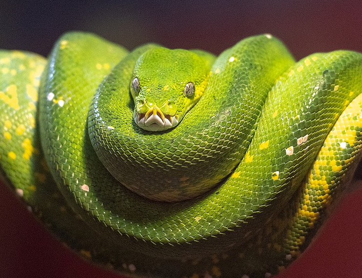

# Practical Python
Python for busy Neuroscientists: from Hello World to Deep Lab Cut. 

Our mascot, Hazel the Green Tree Python.
## Introduction
This is a Python class for complete beginners. Programming is largely muscle memory, so the best way to learn is through deliberate practice. While we will do four weeks of instruction, we will also try to focus on learning by *doing*.

This will be a flipped class, where you learn a lot before each class (using the excellent book [Automate the Boring Stuff with Python](https://automatetheboringstuff.com/2e/)) (ATBS)) and then we meet in each class to discuss what you learned. The goal is to do a crash course in the basics of Python the first two weeks, and then some data science basics the next two weeks. This will be fast-paced, and go over a small subset of the available material, but hopefully will be a fun snapshot of an engaging language!

Each week you will spend a lot of time learning about Python and practicing coding before each class. Then each class will be spent going over any questions you had about the material, reinforcing any key points, and going over code with your instructor.

## Outline

### Week 0: Setting up Jupyter and Python
This week you will set up your programming environment. We will be using [Jupyter notebooks](https://www.nature.com/articles/d41586-018-07196-1), which have become the tool of choice among scientists.  For this material, just go to [getting_started.md](getting_started.md) and follow the instructions there.

### Week 1: Python basics and flow control
Now that you can use Python and run Jupyter notebooks, you are ready to start doing Python. For the first class, you should work through *Chapters 1: Python Basics* and *Chapter 2: Flow Control* from Automate the Boring Stuff. This corresponds to the Jupyter notebook [week1.ipynb](week1.ipynb).

### Week 2: Functions and data structures
We will finish out our overview of the fundamentals of Python by looking at functions in Python, and the main types of data structures (lists, tuples, dictionaries, and strings). These topics correspond to Chapters 3-6 of Automate the Boring Stuff and can be found in the Jupyter notebook [week2.ipynb](week2.ipynb).

### Week 3: Files, virtual environments, and the data science stack
Files, virtual environments, and an introduction to the data science stack (with a focus on numpy, pandas, and matplotlib). We will do some number crunching and data visualization this week.

### Week 4: Deep lab cut project
Using Python IRL. This week you will do a deep dive into a project that approaches the messiness of real life. It will be a lot of work, and your computer will work pretty hard too (many hours to train the model). You will get to see deep learning in action and learn to use an extremely useful package.

### To do
- for week1 class fix it to use two cameras: one for zoom, one to extract and do facial recog.
- Add open ended section at end of each class for students to write questions  (do for class 1 will serve as template students can email me those)
- Add "notes" section at end of each class for students to write notes for in-class section (do for class 1)
- getting_started needs quite a bit of work.
- Also need instructions on how to change default browswer in my windows fresh install it defaulted to freaking MS Edge :(
- do this readme pretty much last just make the classes.

## Acknowledgments
- Developed with the support from NIH Bioinformatics and the Neurobehavioral Core at NIEHS.
- Green Tree Python image is from [Wikimedia](https://commons.wikimedia.org/wiki/File:A_Green_Tree_Python.jpg).
